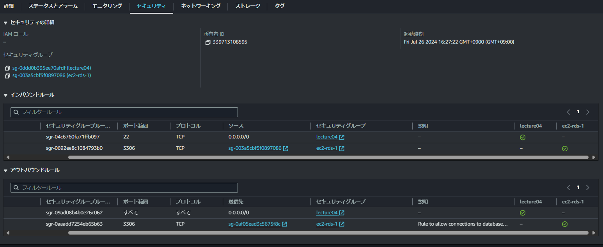

#　第四回課題

## VPC作成

VPC詳細

## EC2

1.EC2概要

2.EC2詳細

3.EC２セキュリティ

## EC2接続

## RDS作成

1.RDS概要

2.RDSセキュリティーグループ

## RDS接続

## EC2ポートIPアドレス

## RDSサブネット

## 不要ルール削除

## 感想

何度作成してもEC2接続がうまくいかなかった。
秘密鍵を上書き保存してしまっていたのがうまくいかない原因だったので、そういったミスで稼働しなくなってしまうので気を付けたい。

## 操作確認

誤って、mainを操作してしまいました。これからは不注意をなくしていきます。

## 再作成

元に戻すことができず停滞してしまった。
知識不足と、理解力が足らないと感じたため努力する。
次の課題では確認を怠らない。