#　第四回課題

## VPC作成

VPC詳細

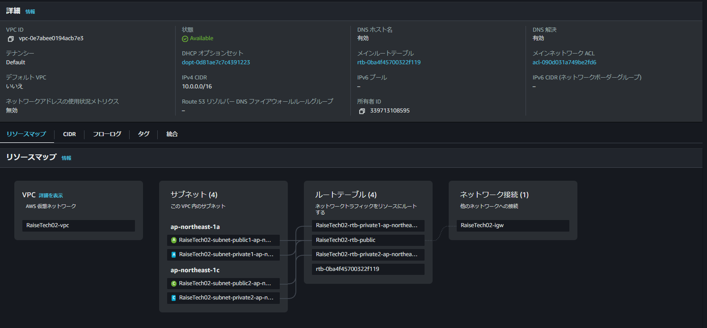

##　EC2

1.EC2概要

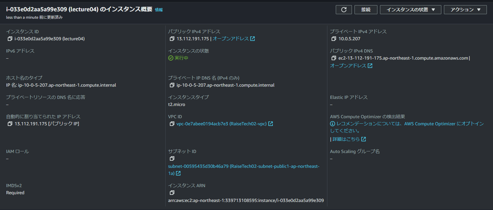

2.EC2詳細

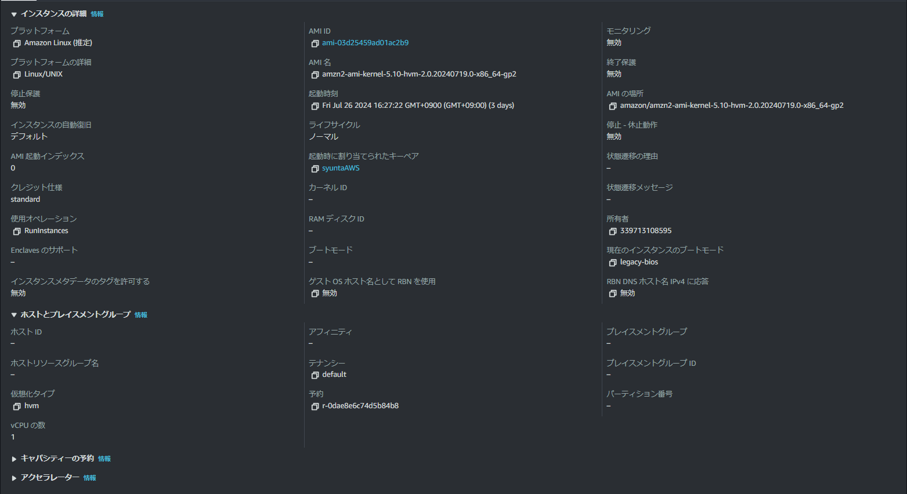

3.EC２セキュリティ

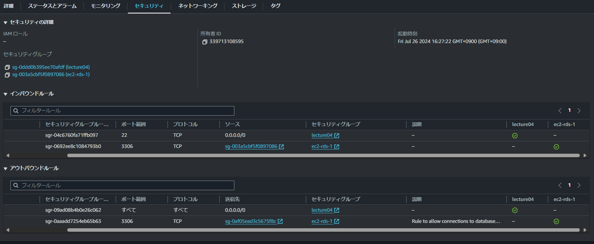

## EC2接続

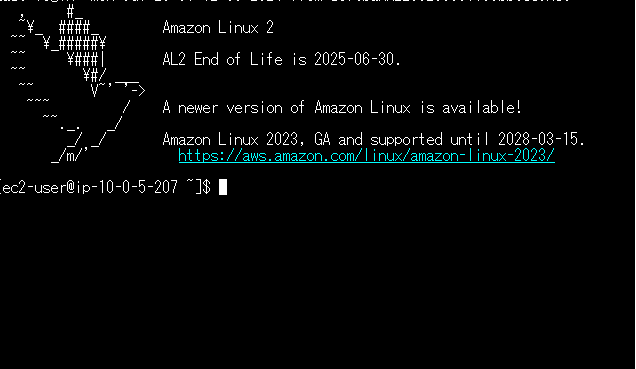

## RDS作成

1.RDS概要

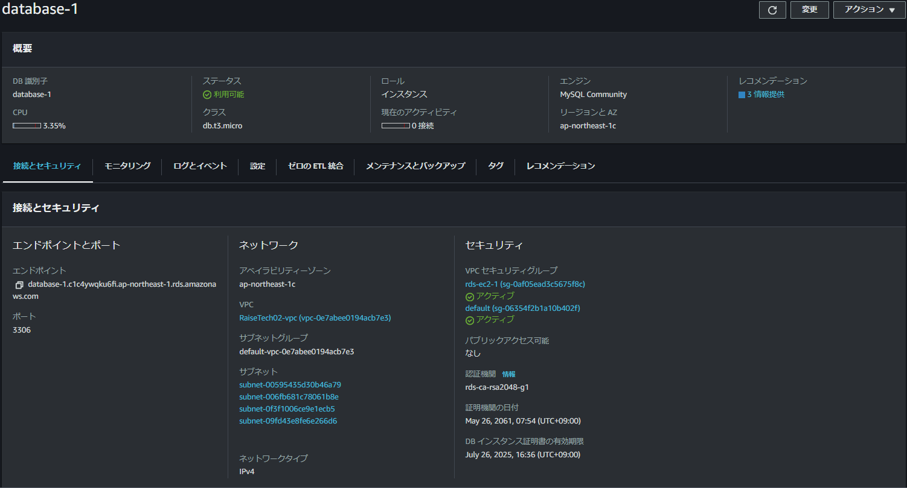

2.RDSセキュリティーグループ

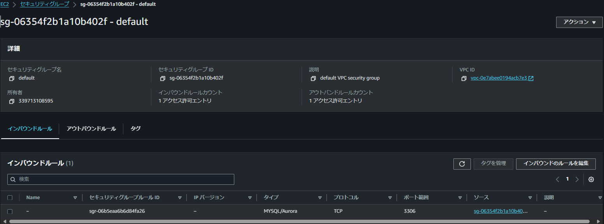

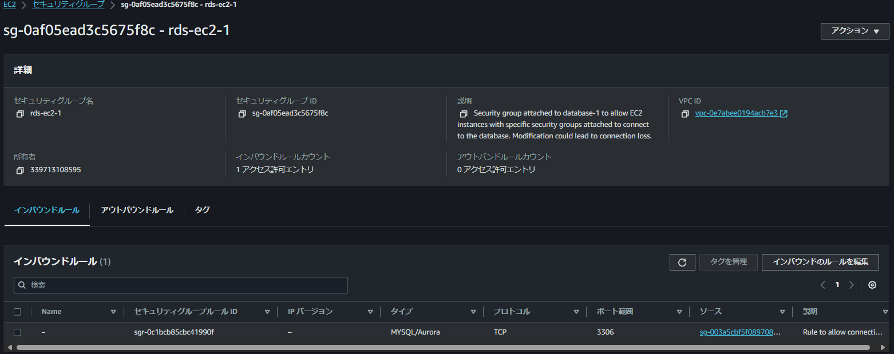

## RDS接続

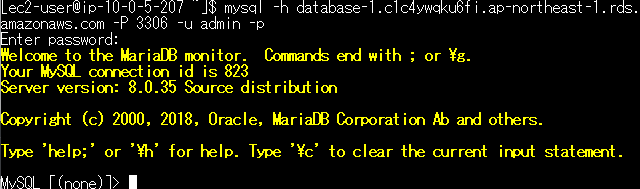

# 修正

## EC2ポートIPアドレス修正

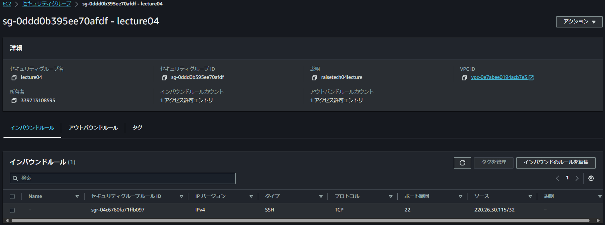

## サブネット修正

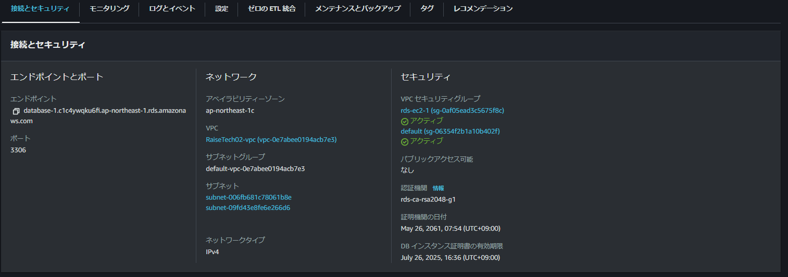

## 不要ルール削除

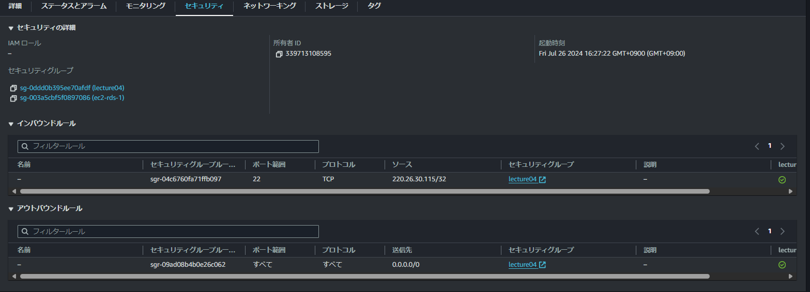

## 感想

時間が空いてしまい、一から学び直しました。
何度作成してもEC2接続がうまくいかなかった。
秘密鍵を上書き保存してしまっていたのがうまくいかない原因だったので、そういったミスで稼働しなくなってしまうので気を付けたい。